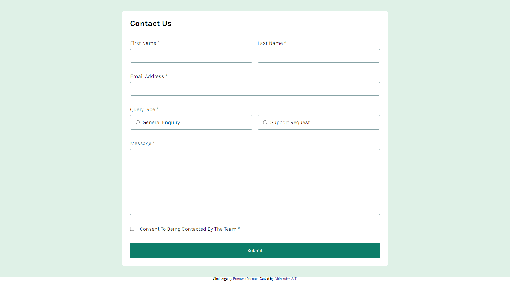
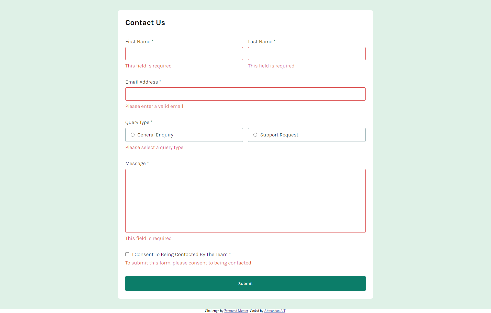
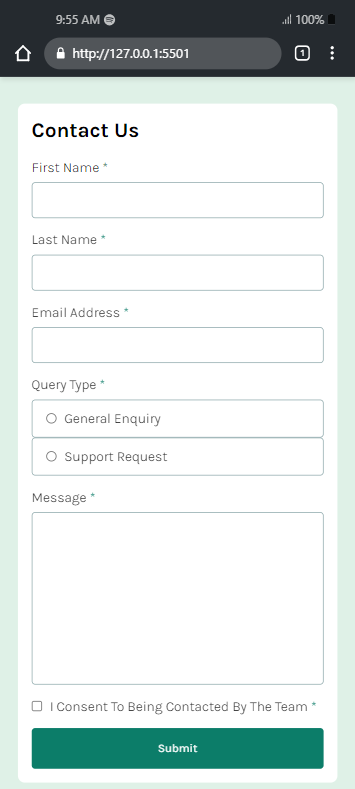
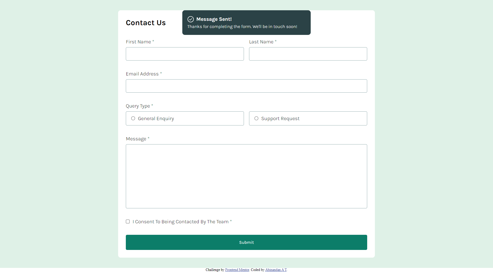

# Frontend Mentor - Contact form solution

This is a solution to the [Contact form challenge on Frontend Mentor](https://www.frontendmentor.io/challenges/contact-form--G-hYlqKJj). Frontend Mentor challenges help you improve your coding skills by building realistic projects.

## Table of contents

- [Overview](#overview)
  - [The challenge](#the-challenge)
  - [Screenshot](#screenshot)
  - [Links](#links)
- [My process](#my-process)
  - [Built with](#built-with)
  - [What I learned](#what-i-learned)
- [Author](#author)

## Overview

### The challenge

Users should be able to:

- Complete the form and see a success toast message upon successful submission
- Receive form validation messages if:
  - A required field has been missed
  - The email address is not formatted correctly
- Complete the form only using their keyboard
- Have inputs, error messages, and the success message announced on their screen reader
- View the optimal layout for the interface depending on their device's screen size
- See hover and focus states for all interactive elements on the page

### Screenshot






### Links

- Live Site URL: https://contact-form-abinandan.netlify.app/

## My process

### Built with

- Custom CSS
- Flexbox
- CSS Grid
- Mobile-first workflow (Media Queries)
- Vanilla JavaScript
- FormData API

### What I learned

I set my notification tab to scroll from top when validation is successful upon submitting the form. And used setTimeout to
take the notification back to top (i.e. hide it from the page) after 3s.

```css
.notification {
  position: fixed;
  left: 50%;
  transform: translate(-50%, -200%);
  background: hsl(187, 24%, 22%);
  color: white;
  border-radius: 0.5rem;
  padding: 1rem;
  line-height: 1.5;
  width: 90%;
  max-width: 400px;
  margin: 0 auto;
  transition: all 0.3s linear;
}
.show-notification {
  transform: translate(-50%, 0%);
}
```

In JS, I validated the form inputs withe the help of FormData API. Then I displayed the notification tab for 3s and remove it from
the page after 3s using setTimeout.

```js
form.addEventListener("submit", async (e) => {
  e.preventDefault();
  const formData = new FormData(e.currentTarget);
  const data = Object.fromEntries(formData);
  // Validate Inputs
  const isValid = validateInputs(data);
  // Notify Success Message
  if (isValid) {
    const notification = document.querySelector(".notification");
    notification.classList.add("show-notification");
    setTimeout(() => {
      notification.classList.remove("show-notification");
    }, 3000);
    // Reset the form
    e.currentTarget.reset();
  }
});
```

If you want more help with writing markdown, we'd recommend checking out [The Markdown Guide](https://www.markdownguide.org/) to learn more.

## Author

- Website - [Abinandan A T](https://my-portfolio-1z8s.onrender.com/)
- Frontend Mentor - [@Abinandan1](https://www.frontendmentor.io/profile/yourusername)
